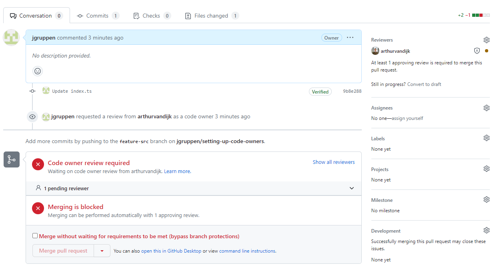

# Setting up code owners


# The dish

To automatically assign reviewers to pull requests based on the files that were changed, you can use the CODEOWNERS file in your Git repository. The CODEOWNERS file allows you to specify code owners for different parts of your project, and these owners will be automatically assigned as reviewers when pull requests affect the files they own. Here's how you can use the CODEOWNERS file:

# Recipe

### 1. Create or locate the CODEOWNERS file: 
In your repository's root directory or in a specific directory, create a new file named CODEOWNERS. If the file already exists, you can modify it.

### 2. Specify the code owners: 
Open the CODEOWNERS file in a text editor and define the code owners for the relevant files or directories. The syntax follows a pattern where each line represents a file or directory pattern followed by one or more GitHub usernames or team names. For example:
```
# Assigning individual users as code owners
/path/to/file @username1 @username2

# Assigning a team as a code owner
/path/to/directory @team-name
``` 
You can use various patterns to match files or directories, such as wildcards (*) and recursive patterns (**). GitHub's documentation provides detailed information on the syntax and examples: [About code owners](https://docs.github.com/en/repositories/managing-your-repositorys-settings-and-features/customizing-your-repository/about-code-owners)

### 3. Commit and push the CODEOWNERS file: 
Save the changes to the CODEOWNERS file and commit it to your repository. Push the changes to make the file available on the remote repository.



### 4: Configure branch protection rules (optional): 
To enforce code review based on the CODEOWNERS file, you can set up branch protection rules in your repository. Branch protection rules allow you to define required reviews and other restrictions for certain branches. You can specify that a pull request must receive approval from a code owner before it can be merged. This step is optional but recommended for enforcing code review based on CODEOWNERS. 

To set up branch protection rules, go to your repository's settings, navigate to the "Branches" or "Branch protection rules" section, and configure the appropriate settings.


# Use case
With the CODEOWNERS file and optionally configured branch protection rules, pull requests that modify files owned by specific individuals or teams will automatically assign those owners as reviewers. This helps ensure that the relevant parties are notified and involved in the code review process for the affected files.